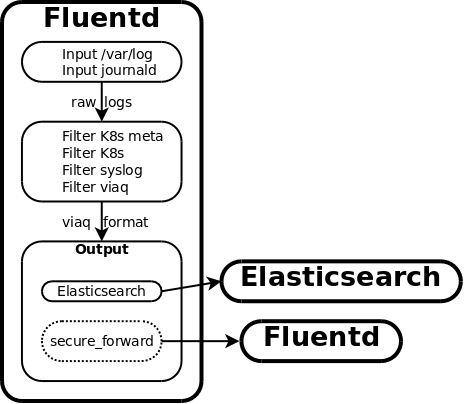
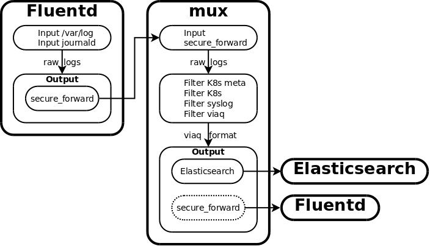
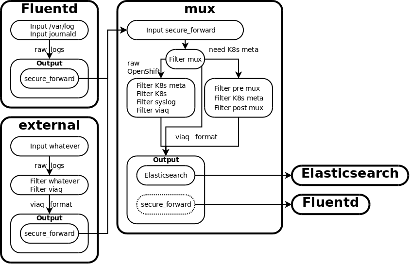
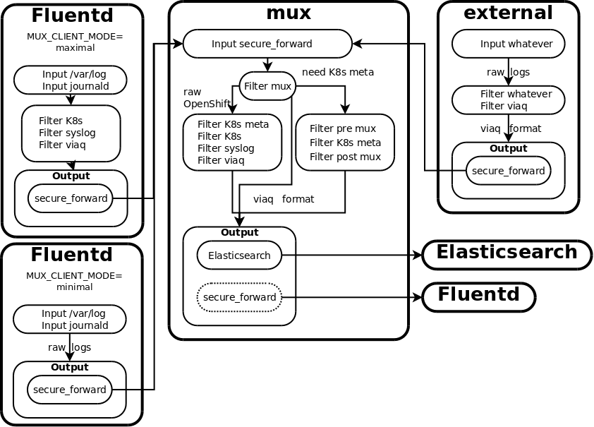

Introduction
============

Fluentd gets Kubernetes metadata to enrich each container log message with the
namespace UUID, the pod UUID, and pod labels and annotations.  If you have a
large number of nodes, this means many connections to the Kubernetes API
server.  This also requires a lot of processing and filtering on each node.

The component called *mux* is a Service and a DeploymentConfig that allows the
Fluentd collectors running on each node to offload the Kubernetes metadata
lookup and other enrichment to a central service.  The Fluentd collectors on
each node use the *secure_forward* protocol to send the raw logs to *mux* for
Kubernetes metadata and other enrichment, and then for storage in
Elasticsearch.  This offloads the processing from each node, and reduces the
load on the Kubernetes API server.

*mux* is short for multiplex, because it acts like a multiplexor or manifold,
taking in connections from many collectors, and distributing them to a data
store.  Another term would be FEAN, short for
Forward/Enrich/Aggregate/Normalize.

*mux* can also be exposed as an external service.  This allows the ability to
set up an OpenShift cluster to act as a central logging service for other
projects and products outside of the cluster.

### Server Side Configuration ###

There is a deploymentConfig - `logging-mux`.  This is the central logging
service.  There is also a `logging-mux` Service which exposes the
secure_forward listener port using `externalIPs`.  There is a Secret
`logging-mux` which holds the server `cert` and `key`, the `ca` cert, and the
`shared_key` used by the secure_forward protocol.  The `ca` cert and the
`shared_key` are used by clients of the logging-mux service.  There is a
ConfigMap which has `fluent.conf` and `secure-forward.conf`.  These are
essentially the same as in the logging-fluentd configmap.

There are environment variables for the logging-mux DC config:

* `USE_MUX` - `true`/`false` - default is `false` - if `true`, the logging-mux
  will act as a service inside the cluster for the Fluentd collectors running
  on each node.  This allows the per-node Fluentd collectors to read and ship
  logs off the node as fast as possible to the logging-mux service, which will
  normalize and enrich with Kubernetes metadata, and store in Elasticsearch.
  This will also be able to process records sent from outside of the cluster,
  if the service has exposed an externalIP.
* `FORWARD_LISTEN_PORT` - default `24284` - port to listen for secure_forward
  protocol log messages
* `FORWARD_LISTEN_HOST` - hostname to listen for secure_forward protocol log
  messages - this is the same as the FQDN in the mux server cert

These are environment variables for the logging-fluentd daemonset config:

* `MUX_CLIENT_MODE` - `minimal`/`maximal` - default is unset - If this is not
  set, Fluentd will perform all of the processing, including Kubernetes
  metadata processing, and will send the records directly to Elasticseach.
  If `maximal`, then fluentd will do as much processing as possible at the node
  before sending the records to mux.  This is the current recommended way to
  use mux due to current scaling issues.  In this case, it is assumed you want
  to deploy mux to be as lightweight as possible, and move as much of the
  processing burden as possible to the individual Fluentd collector pods
  running on each node.
  If `minimal`, then fluentd will perform *no* processing and send the raw logs
  to mux for processing.  We do not currently recommend using this mode, and
  ansible will warn you about this.

At the present time, the only scalable way to use mux is with
`MUX_CLIENT_MODE=maximal`, which pushes as much of the log processing burden as
possible on to every node running Fluentd.  With `minimal`, mux quickly becomes
overwhelmed with processing all of the log records, and requires scaling up a
large number of pods to keep up with the load.  However, this may change in the
future.

The logging-mux Service must be configured with an externalIP in order to
receive records sent from outside the cluster.

### Ansible Configuration ###

There are several new Ansible parameters which can be used with the
`openshift_logging` role:

* `openshift_logging_use_mux` - `True`/`False` - default `False` - if
  `True`, create the mux Service, DeploymentConfig, Secrets, ConfigMap, etc.
- `openshift_logging_mux_client_mode`: Values - `minimal`, `maximal`.
  Default is unset.  If this value is is unset, Fluentd will perform all of the
  processing, including Kubernetes metadata processing, and will send the
  records directly to Elasticseach.
  The value `maximal` means that Fluentd will do as much processing as possible
  at the node before sending the records to mux.  This is the current
  recommended way to use mux due to current scaling issues.
  The value `minimal` means that Fluentd will do *no* processing at all, and
  send the raw logs to mux for processing.  We do not currently recommend using
  this mode, and ansible will warn you about this.
* `openshift_logging_mux_allow_external` - `True`/`False` - default `False` - if
  `True`, expose the mux service external to the cluster
* `openshift_logging_mux_hostname` - default
  "mux."`openshift_master_default_subdomain`.  This is the hostname that
  clients outside the cluster will use, the one used in the mux TLS server cert
* `openshift_logging_mux_port` - default 24284 - the port used by the mux Service
  to listen for `secure_forward` protocol log messages

Other parameters are similar to parameters for the other components, for
example `openshift_logging_mux_cpu_request`,
`openshift_logging_mux_memory_limit`, `openshift_logging_mux_replica_count`,
`openshift_logging_mux_nodeselector`

Sending Records to mux
-------------------------------

### Fluentd secure_forward ###

You will need the mux CA cert and shared_key.  You can obtain them from the
logging cluster like this:

    # oc login --username=system:admin
    # oc project logging
    # oc get secret logging-mux --template='{{index .data "ca"}}' | base64 -d > mux-ca.crt
    # oc get secret logging-mux --template='{{index .data "shared_key"}}' | \
      base64 -d > mux-shared-key

The client side setup should look something like this:

    <match **something**>
      @type secure_forward
      self_hostname forwarding-${hostname}
      ca_cert_path /path/to/mux-ca.crt
      secure yes
      enable_strict_verification true
      shared_key "#{File.open('/path/to/mux-shared-key') do |f| f.readline end.rstrip}"
      <server>
        host mux.logging.test
        hostlabel mux.logging.test
        port 24284
      </server>
    </match>

Fluentd collectors running in the cluster will mount the logging-mux secret at
`/etc/fluent/muxkeys` in order to use the `ca` and `shared_key`.

### Tag ###

The log records coming from the client should be tagged in the following
format: `project.$namespace_name.other.data`
* `project` is the literal string "project"
* `$namespace_name` is the name of an OpenShift namespace.  For example,
  something returned by the command `oc get projects`.  With OpenShift 1.5/3.5
  and later, there is a 63 character limit on the namespace name.
* `other.data` - mux will ignore the rest of the tag parts after
  `$namespace_name` - this can be omitted - you can use a tag like
  `project.namespacename`

These logs will be written to Elasticsearch in an index with a name like the
following: `project.$namespace_name.$namespace_uuid.YYYY.MM.DD`
* `project` is the literal string "project"
* `$namespace_name` is the name of the OpenShift namespace
* `$namespace_uuid` is the UUID of the OpenShift namespace - fluentd will look
  this up from OpenShift/Kubernetes using the kubernetes metadata filter
* `YYYY.MM.DD` is the year, month, and day

The namespaces used in the tag must be added ahead of time to OpenShift - for
example, something like this:

    for namespace in my-namespace-a my-namespace-b ; do
        oadm new-project $namespace --node-selector=''
    done

If the tag is not in the `project.namespacename` format, the log records will
use a namespace of `mux-undefined`, so the log records will be in an index
named something like `project.mux-undefined.$mux-undefined_uuid.YYYY.MM.DD`

### Data Format ###

The log record should use the top-level field `@timestamp` as the timestamp of
the record.  If this field is not present, the field `time` will be used and
converted to `@timestamp` when written to Elasticsearch.  The timestamp should
be in the following format:

    {
        "@timestamp": "2017-04-13T13:20:20.123456Z",

It should be in `date -u -Ins` (ISO 8601) format *except* use `.` instead of
`,` for the separator between the seconds and the nanoseconds value.  The use
of nanoseconds is not required.  In general, the more precision you can provide
in your timestamps, the better.  If the highest resolution the application can
provide is seconds that is acceptable.  You can use either use a trailing `Z`
or `+0000` or `+00:00`.  For example, in a Fluentd record_transformer, you
could use `Time.now.utc.to_datetime.rfc3339(6)`:

    <filter project.my-namespace.**>
      @type record_transformer
      enable_ruby
      <record>
        time ${Time.now.utc.to_datetime.rfc3339(6)}

would set `time` to `2017-04-13T22:13:32.580341+00:00`.  The
[viaq_data_model plugin](https://github.com/ViaQ/fluent-plugin-viaq_data_model)
can be used to convert `time` to `@timestamp`.

It is highly recommended to add as many of the fields as possible described in
[Default Fields](https://github.com/ViaQ/elasticsearch-templates/blob/master/namespaces/_default_.yml)
in order to maximize the utility of the data, being able to correlate the data
with data from other deployments and applications, etc.  For application
specific data, create a namespace with the fields described in one or more
namespace templates such as found in the
[namespaces directory](https://github.com/ViaQ/elasticsearch-templates/blob/master/namespaces).

mux Fluentd Config Details
--------------------------

### About the Diagrams ###

A Fluentd node collector agent can read from either the systemd journal or from
log files.  `Input /var/log` and `Input journald` mean that Fluentd will read
from whichever of these it is configured to read from.

`Filter k8s` takes the json-file or journald container log input and formats it
using the ViaQ data model (i.e. the `kubernetes` and `docker` namespaces).

`Filter syslog` takes the `/var/log/messages` or journald system log input and
formats it using the ViaQ data model (i.e. the `systemd` namespace).  **NOTE**
reading from `/var/log/messages` is no longer supported.  `journald` is always
used for system logs.

`Filter k8s meta` looks up Kubernetes metadata for container log records from
the Kubernetes server such as namespace\_uuid, pod\_uuid, labels, and
annotations.

`Filter viaq` removes empty fields and makes sure the time field is
`@timestamp`.

`Filter mux` determines what type of processing the log record needs - full
processing, k8s meta only, or no further processing, and sends the log record
to the appropriate processing pipeline, with the appropriate tagging and
annotations.

`Filter pre mux` prepares records received by mux and processed in the `Filter
mux` step for Kubernetes metadata annotation.

`Filter post mux` removes any temporary log record annotations added by
previous mux filtering steps.

A `raw` log is a log that is directly from the source, with no filtering or
formatting applied to it yet.

`viaq format` means that the log record is in the ViaQ format at this stage in
the pipeline, ready to be sent to Elasticsearch, or secure_forward to an
external logging system.

`secure_forward` is the Fluentd secure_forward protocol.  If there is a dashed
or broken line in the box around it, that means it is an optional component
e.g. for shipping logs out of the cluster to another logging system.

The `Elasticsearch` output inside of a larger box means the Elasticsearch
output plugin.  The large, standalone `Elasticsearch` means the Elasticsearch
storage cluster component of OpenShift logging.

### Basic Flow ###

This is what the flow looks like normally, when `MUX_CLIENT_MODE` is
unset.  mux is not used at all, Fluentd does all of the processing and sends
logs directly to Elasticsearch:

With Fluentd configured with `MUX_CLIENT_MODE minimal`, and with mux configured
with `USE_MUX true` (`minimal` is not currently recommended to use):

OpenShift Fluentd node collector sends raw records, collected from `json-file`
or `journald` or both, to the mux service via secure_forward.
mux processes the logs using the normal OpenShift log filter/enrichment process
and sends the logs to Elasticsearch.

Flow:

With `USE_MUX true`:

In addition to the above, mux will examine the tags of the incoming
`secure_forward` records, which can come from `secure_forward` clients outside
of the cluster.  It is expected that the record has the `@timestamp` field and
is already formatted for the ViaQ data model.  If the tag matches
`project.namespacename.**`, mux extracts the `namespacename` and passes this to
the k8s meta filter plugin in order to get the namespace uuid.  If the tag does
not match, mux uses a namespacename of `mux-undefined`.  Except for the k8s
meta filter, and the viaq filter, the record is not processed.  The record is
written to Elasticsearch in the index
`project.namespacename.namespaceuuid.YYYY.MM.DD`, similar to how OpenShift
container records are written.

Flow:

With Fluentd configured with `MUX_CLIENT_MODE maximal`:

Fluentd will perform as much of the processing and formatting as possible of
log records read from files or journald.  Mux will perform the Kubernetes
metadata annotation before submitting the records to Elasticsearch.  `maximal`
mode is the currently recommended mode to use with mux.

Flow:

### Details ###

mux *does not* read the logs/journal on the system - it does not mount
`/var/log`, etc.  This is why it is a DeploymentConfig and not a DaemonSet.  As
such, mux does not need to mount `/var/log`, `/var/lib`, and `/run/log`.
However, since it does need to know the absolute time, it still needs to mount
`/etc/localtime` from the host.

The records come into mux via the secure_forward listener:

    <source>
      @type secure_forward
      @label @MUX
      port "#{ENV['FORWARD_LISTEN_PORT'] || '24284'}"
      self_hostname "#{ENV['FORWARD_LISTEN_HOST'] || 'mux.example.com'}"
      shared_key "#{File.open('/etc/fluent/muxkeys/shared_key') do |f| f.readline end.rstrip}"
      secure yes
      cert_path /etc/fluent/muxkeys/cert
      private_key_path /etc/fluent/muxkeys/key
    </source>

The `logging-mux` secret is mounted on `/etc/fluent/muxkeys` and holds the mux
TLS server `cert` and `key`, as well as the `ca` cert and the `shared_key`.

These records are sent to the `@MUX` label.  The first thing here is this
filter:

    <match journal>
      @type relabel
      @label @INGRESS
    </match>

Records tagged with `journal` are "raw" records from a Fluentd running in
`minimal` mode.  Just send these to `@INGRESS` for regular processing.

The next filter is this:

    <filter kubernetes.var.log.containers.**>

Since mux has no way to know if the Kubernetes records were read from
`json-file` or `journald`, mux hardcodes its Kubernetes metadata filter to use
the `journald` method, which uses the fields `CONTAINER_NAME` and
`CONTAINER_ID_FULL`.  The filter extracts the k8s metadata from the Fluentd tag
to create the values for these fields, if the fields do not already exist.  It
is much easier to add/rewrite a field than to rewrite a tag, which is why the
k8s meta filter plugin is configured to use the `journald` fields rather than
the `json-file` Fluentd tags.

The next stage in the pipeline is this match:

    <match system.var.log.messages** kubernetes.** journal.container** journal.system**>

If this record has already been processed by Fluentd e.g. in
`MUX_CLIENT_MODE=maximal` then tag it so that it will be processed by the k8s
plugin (if `kubernetes.**`), and have an index name created for it, but will
not be processed in any other way.  Assume that if the record has the
`@timestamp` field then it has already been processed, and tag it with a `.mux`
suffix.  Otherwise, assume it is a raw record, tag it with a `.raw` suffix, and
redirect to `@INGRESS` processing.

The next stage in the pipeline is this filter:

    <filter **>

This examines the tag to see if it is of the form
`project.namespacename.whatever`, and sets the field `mux_namespace_name` to
the value of `namespacename` if it is in that form, or `mux-undefined`
otherwise.  This also examines the record to see if the
`kubernetes.metadata_uuid` field exists and has a value, to see if the record
can bypass the k8s metadata plugin, and adds the field `mux_need_k8s_meta` with
a value of `true` or `false`.

The next stage in the pipeline is a rewrite tag filter:

    <match **>

If `mux_need_k8s_meta` is `false`, the tag is rewritten to be `mux`.  This
causes all further filtering to be bypassed (except for the viaq filter).  If
`mux_need_k8s_meta` is `true`, the tag is rewritten in the following format:
`kubernetes.var.log.containers.mux-mux.mux-mux_$1_mux-64digits.log.mux` where
`$1` is the value of the `mux_namespace_name` field.  This tag format was
chosen because it will match the k8s meta filter plugin match

    <filter kubernetes.**>

but it will not match any of the other kubernetes log record filters.

Then all records are passed to the `@INGRESS` label, where there are two
additional mux related filters.  The first one is this:

    <filter kubernetes.var.log.containers.mux-mux.mux-mux_**.mux>

This filter will add the `CONTAINER_NAME` and `CONTAINER_ID_FULL` fields to the
record if they do not already exist so that the k8s meta filter plugin will
add the `kubernetes.namespace_id`, labels, and annotations.

The next step is this filter:

    <filter kubernetes.var.log.containers.**.raw>

Records from container `json-file` logs, passed by a Fluentd running in
`minimal` mode, will not have undergone JSON file parsing of the `log` field,
and that process will also be skipped in mux since mux runs the k8s meta
plugin, which normally does the JSON file parsing of the `log` field, in
`use_journal true` mode, which looks for the `MESSAGE` field instead.  This
filter does the JSON `log` field parsing.

The ViaQ filter plugin will construct the index name using the fields
`kubernetes.namespace_name` and `kubernetes.namespace_id` added by the k8s
meta filter plugin (or by the client), and the `@timestamp` field.

The last mux related filter is this one, run after the ViaQ filter:

    <filter kubernetes.var.log.containers.mux-mux.mux-mux_**.mux>

This filter just strips away the transient fields added by the above
processing, such as
`docker,kubernetes,CONTAINER_NAME,CONTAINER_ID_FULL,mux_namespace_name,mux_need_k8s_meta,namespace_name,namespace_uuid`
that we do not want to store in Elasticsearch, and are not needed after
constructing the index name.
