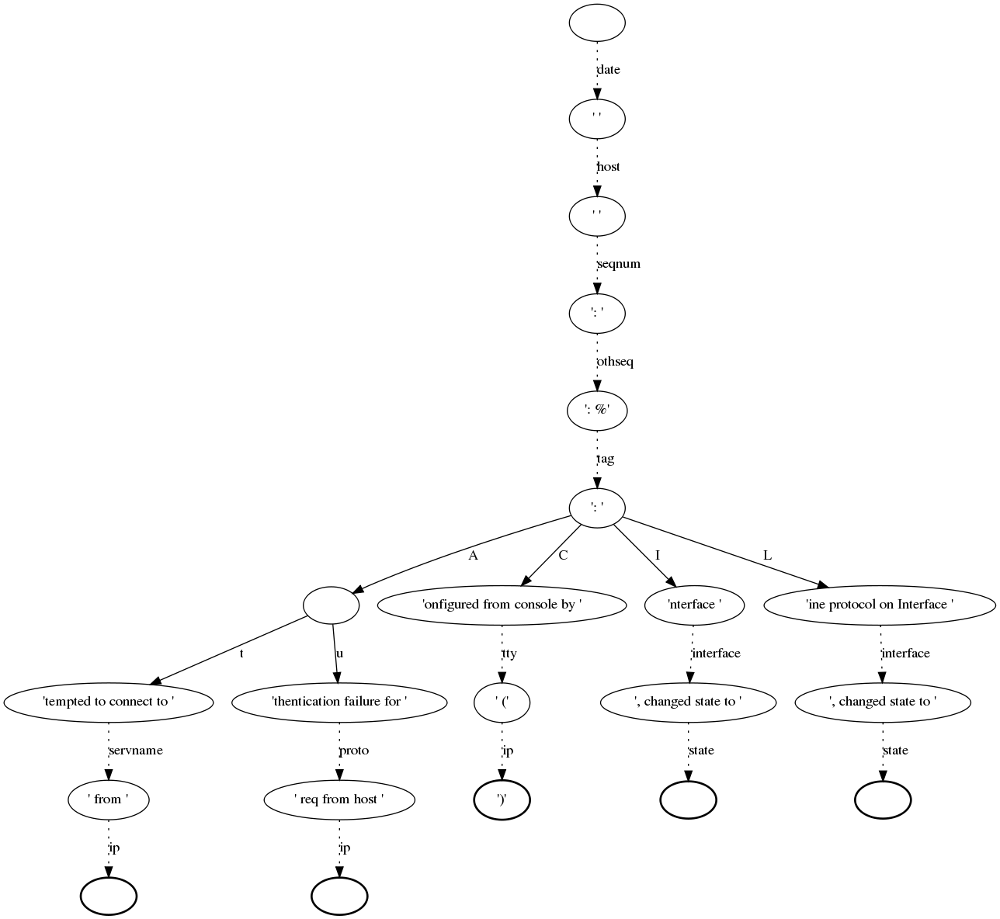

Lognormalizer
=============

Lognormalizer is a sample tool which is often used to test and debug 
rulebases before real use. Nevertheless, it can be used in production as 
a simple command line interface to liblognorm.

This tool reads log lines from its standard input and prints results 
to standard output. You need to use redirections if you want to read 
or write files.

An example of the command::

    $ lognormalizer -r messages.sampdb -e json <messages.log

Command line options
--------------------

::

    -V

Output version information, including information about the installed
version of liblognorm and its optional features. So this may also be
used to check the currently installed library version.

::

    -r <FILENAME>

Specifies name of the file containing the rulebase.

::

    -v
    
Increase verbosity level. Can be used several times. If used three
times, internal data structures are dumped (make sense to developers,
only).

::

    -p

Print only successfully parsed messages.

::

    -P

Print only messages **not** successfully parsed.

::

    -L

Add line number information to events not successfully parsed. This
is meant as a troubleshooting aid when working with unparsable events,
as the information can be used to directly go to the line in question
in the source data file. The line number is contained in a field
named ``lognormalizer.line_nbr``.

::

    -t <TAG>
    
Print only those messages which have this tag.
    
::

    -T

Include 'event.tags' attribute when output is in JSON format. This attribute contains list of tags of the matched 
rule.

::

    -E <DATA>

Encoder-specific data. For CSV, it is the list of fields to be output, 
separated by comma or space. It is currently unused for other formats.

::

    -d <FILENAME>

Generate DOT file describing parse tree. It is used to plot parse graph 
with GraphViz.

::

    -H

At end of run, print a summary line with number of messages processed,
parsed and unparsed to stdout.

::

    -U

At end of run, print a summary line with number of messages unparsed to
stdout. Note that this message is only printed if there was at least one
unparsable message.

::

    -o

Special options. The following ones can be set:

   * **allowRegex** Permits to use regular expressions inse the v1 engine
     This is deprecated and should not be used for new deployments.

   * **addExecPath** Includes metadata into the event on how it was
     (tried) to be parsed. Can be useful in troubleshooting normalization
     problems.

   * **addOriginalMsg** Always add the "original-msg" data item. By
     default, this is only done when a message could not be parsed.

   * **addRule** Add a mockup of the rule that was processed. Note that
     it is *not* an exact copy of the rule, but a rule that correctly
     describes the parsed message. Most importantly, prefixes are 
     appended and custom data types are expanded (and no longer visiable
     as such). This option is primarily meant for postprocessing, e.g.
     as input to an anonymizer.

   * **addRuleRulcation** For rules that successfully parsed, add the
     location of the rule inside the rulebase. But the file name as
     well as the line number are given. If two rules evaluate to the same
     end node, only a single rule location is given. However, in
     practice this is extremely unlikely and as such for practical
     reasons the information can be considered reliable.

::

    -s <FILENAME>

At end of run, print internal parse DAG statistics and exit. This
option is meant for developers and researches which want to get insight
into the quality of the algorithm and/or how efficient the rulebase could
be processed. **NOT** intended for end users. This option is performance
intense.

::

    -S <FILENAME>

Even stronger statistics than -s. Requires that the version is compiled
with --enable-advanced-statistics, which causes a considerable
performance loss.

::

   -x <FILENAME>

Print statistics as a DOT file. In order to keep the graph readable,
information is only emitted for called nodes.

::

    -e <json|xml|csv|raw|cee-syslog>

Output format. By default, output is in JSON format. With this option,
you can change it to a different one.

Supported Output Formats
........................
The JSON, XML, and CSV formats should be self-explanatory.

The cee-syslog format emits messages according to the Mitre CEE spec.
Note that the cee-syslog format is primarily supported for
backward-compatibility. It does **not** support nested data items
and as such cannot be used when the rulebase makes use of this
feature (we assume this most often happens nowadays). We strongly
recommend not use it for new deployments. Support may be removed
in later releases.

The raw format outputs an exact copy of the input message, without
any normalization visible. The prime use case of "raw" is to extract
either all messages that could or could not be normalized. To do so
specify the -p or -P option. Also, it works in combination with the
-t option to extract a subset based on tagging. In any case, the core
use is to prepare a subset of the original file for further processing.

Examples
--------

These examples were created using sample rulebase from source package.

Default (CEE) output::

	$ lognormalizer -r rulebases/sample.rulebase
	Weight: 42kg
	[cee@115 event.tags="tag2" unit="kg" N="42" fat="free"]
	Snow White and the Seven Dwarfs
	[cee@115 event.tags="tale" company="the Seven Dwarfs"]
	2012-10-11 src=127.0.0.1 dst=88.111.222.19
	[cee@115 dst="88.111.222.19" src="127.0.0.1" date="2012-10-11"]

JSON output, flat tags enabled::

	$ lognormalizer -r rulebases/sample.rulebase -e json -T
	%%
	{ "event.tags": [ "tag3", "percent" ], "percent": "100", "part": "wha", "whole": "whale" }
	Weight: 42kg
	{ "unit": "kg", "N": "42", "event.tags": [ "tag2" ], "fat": "free" }

CSV output with fixed field list::

	$ lognormalizer -r rulebases/sample.rulebase -e csv -E'N unit'
	Weight: 42kg
	"42","kg"
	Weight: 115lbs
	"115","lbs"
	Anything not matching the rule
	,

Creating a graph of the rulebase
--------------------------------

To get a better overview of a rulebase you can create a graph that shows you 
the chain of normalization (parse-tree).

At first you have to install an additional package called graphviz. Graphviz 
is a tool that creates such a graph with the help of a control file (created 
with the rulebase). `Here <http://www.graphviz.org/>`_ you will find more 
information about graphviz.

To install it you can use the package manager. For example, on RedHat 
systems it is yum command::

    $ sudo yum install graphviz

The next step would be creating the control file for graphviz. Therefore we 
use the normalizer command with the options -d "prefered filename for the 
control file" and -r "rulebase"::

    $ lognormalize -d control.dot -r messages.rb

Please note that there is no need for an input or output file.
If you have a look at the control file now you will see that the content is 
a little bit confusing, but it includes all information, like the nodes, 
fields and parser, that graphviz needs to create the graph. Of course you 
can edit that file, but please note that it is a lot of work.

Now we can create the graph by typing::

    $ dot control.dot -Tpng >graph.png

dot + name of control file + option -T -> file format + output file

That is just one example for using graphviz, of course you can do many 
other great things with it. But I think this "simple" graph could be very 
helpful for the normalizer.

Below you see sample for such a graph, but please note that this is 
not such a pretty one. Such a graph can grow very fast by editing your 
rulebase.

